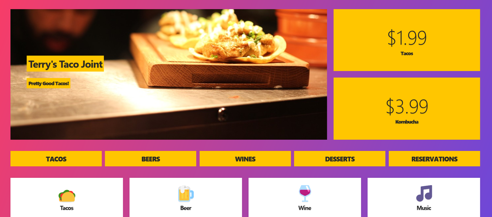

<h1>
Responsive Website Challenge 💻
</h1>

---

### Practicing CSS!

This is a challenge from the CSS grid course by Wes Bos. Currently working through short grid and flexbox courses to improve my understanding of how these features work

---
